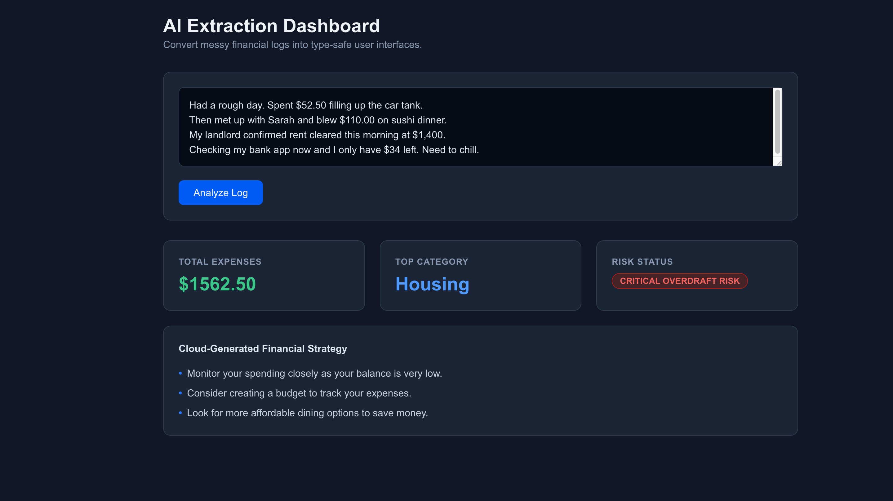

# AI Extraction Dashboard

This is a Next.js dashboard app that converts messy financial logs into structured financial data using AI.

## What this project does

- Provides a frontend UI to paste a financial text log
- Sends the log text to a server API route
- Uses AI to extract structured data from the text
- Displays the result as dashboard cards
- Uses schema validation to ensure the output is reliable
- Includes a mock fallback so the app runs even without AI credentials

## Key features

- `app/page.tsx`: React client page with textarea, submit button, and dashboard cards
- `app/api/analyze/route.ts`: server API route that processes text and returns structured results
- `zod` validation: ensures the returned object has the correct shape
- AI integration: supports Google AI Studio key and Vercel AI Gateway key
- Local fallback: returns mock data when no valid API key is configured

## Tech stack

- Next.js 16
- React 19
- TypeScript
- Tailwind CSS
- Vercel AI SDK (`ai`)
- Google AI provider (`@ai-sdk/google`)
- `zod` for schema validation

## Local setup

```bash
cd ai-dashboard
npm install
npm run dev
```

Open [http://localhost:3000](http://localhost:3000) in your browser.

## Screenshot




## Environment variables

Create or update `./.env.local` with either of these keys:

```env
# Use if you have Google AI Studio credentials
GOOGLE_GENERATIVE_AI_API_KEY=your_google_ai_studio_key

# Use if you want Vercel AI Gateway instead
AI_GATEWAY_API_KEY=your_vercel_ai_gateway_key
```

### Note
If no valid key is present, the app still works using a mock fallback. That means you can still demo the UI and pipeline even without AI credentials.

## How the AI route works

- The client calls `/api/analyze` with the user input text
- The API route checks for `GOOGLE_GENERATIVE_AI_API_KEY` and `AI_GATEWAY_API_KEY`
- If a key exists, it calls AI to extract structured financial data
- If no key exists, it returns a local mock result
- The result is validated against `FinancialSchema`

## Deploying to Vercel

1. Push this repo to GitHub or another Git provider
2. Import the project on Vercel
3. Add environment variables in Vercel:
   - `GOOGLE_GENERATIVE_AI_API_KEY` or
   - `AI_GATEWAY_API_KEY`
4. Deploy the app

If you don’t want to add a key, the deployed app still runs with the local mock fallback.

## Why this is a good AI demo

- Demonstrates frontend + backend AI integration
- Shows how to use schema validation for AI output
- Includes a safe fallback path for demos without credentials
- Uses a real AI SDK and an actual provider model

## Useful commands

```bash
npm run dev
npm run build
npm run start
npm run lint
```

## Files to highlight

- `app/page.tsx` — frontend analysis UI
- `app/api/analyze/route.ts` — AI extraction route
- `.env.local` — store your API keys here
- `package.json` — project dependencies and scripts

---
